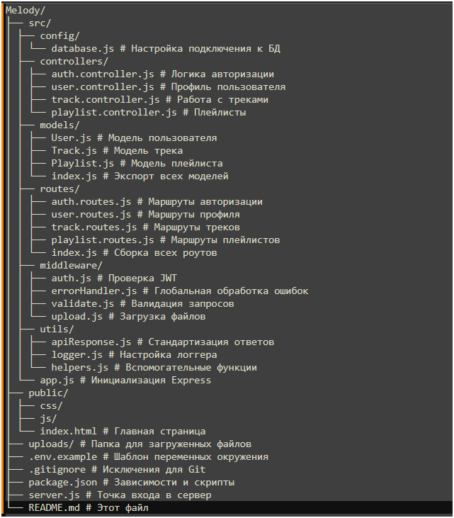

# Melody - Музыкальный веб-сервис

# Платформа для прослушивания музыки, управления плейлистами и персонализации контента.

---

## Оглавление
- [О проекте](#-o-проекте)
- [Технологии](#-технологии)
- [Структура проекта](#-структура-проекта)
- [Быстрый старт](#-быстрый-старт)
- [Переменные окружения](#-структура-веток)
- [API Документация](#-api-документация)
- [Тестирование](#-тестирование)
- [Вкладка в проект](#-вклад-в-проект)

---

## О проекте

**Melody** - это веб-приложение для:
- Поиск и прослушивания музыкальных треков
- Создания и управления плейлистами
- Персонализация профиля пользователя
- Безопасной авторизации и управления доступом

### Основные функции
| Функция | Описание | Статус |
|---------|----------|--------|
| Регистрация/Вход | JWT-аутенфикация с refresh-токенами | ✅ |
| Профиль пользователи | Аватар, настройки, история | ✅ |
| Музыкальная библиотека | Загрузка, каталогизация, поиск | ✅ |
| Плейлисты | Создание, редактирование, шаринг | ✅ |
| Плеер | Воспроизведение, очередь, рекомендации | ✅ |

---

## ⚙️ Технологии

### Backend
- **Node.js** + **Express** - серверная платформа
- **PostgreSQL** - реляционная база данных
- **Sequalize/Knex** - ORM/Query builder
- **bcrypt** - хэширование паролей
- **jsonwebtoken** - JWT-аутенфикация

### Frontend
- **HTML5/CSS3/JavaScript** - базовая вёрстка
- **Fetch API** - взаимодействие с бэкендом

### Инструменты
- **Git/GitHub** - контроль версий
- **npm** - управление зависимостями
- **dotenv** - управление конфигацией
- **winston/pino** - логирование

---

## 🗂️ Структура проекта



## 🚀 Быстрый старт

### Требования
- Node.js >= 18.x
- PostgreSQL >= 14.x
- npm >= 9.x

### Установка 

# 1. Клонируйте репозиторий
```bash
git clone https://github.com/tehnolize/Melody.git
cd Melody
```

# 2. Установите зависимости
```bash
npm install
```

# 3. Настройте окружение 
```bash
cp .env.example .env
```

# Отредактируйте .env (см. раздел ниже)

# 4. Инициализируйте базу данных
```bash
npm run migrate
```

# 5. Запустите сервер в режиме разработки
```bash
npm run dev
```

# 6. Для продакшена:
```bash
npm start
```

Доступные скрипты (package.json)

| Команды              | Описание                      |
|----------------------|-------------------------------|
|npm run dev           | Запуск с nodemon (hot-reload) |
|npm start             | Запуск в продакшен-режиме     |
|npm run migrate       | Применение миграций БД        |
|npm run migrate:undo  | Откат последней миграции      |
|npm test              | Запуск тестов                 |
|npm run test:coverage | Тесты с покрытием             |
|npm run lint          | Проверка стиля кода (ESLint)  |

⚙️ Пемеренные окружения 

Создайте файл .env на основе .env.example

### СЕРВЕР
```bash
NODE_ENV=development
PORT=3000
API_PREFIX=/api/v1
CORS_ORIGIN=http://localhost:5173
```

## БАЗА ДАННЫХ (PostgreSQL)
```bash
DB_HOST=localhost
DB_PORT=5432
DB_NAME=melody
DB_USER=postgres
DB_PASSWORD=your_secure_password
DB_POOL_MIN=2
DB_POOL_MAX=10
```

## JWT АУТЕНТИФИКАЦИЯ
```bash
JWT_SECRET=your_super_secret_key_change_in_production
JWT_ACCESS_EXPIRES_IN=15m
JWT_REFRESH_EXPIRES_IN=7d
```

## EMAIL (восстановление пароля)
```bash
SMTP_HOST=smtp.mail.ru
SMTP_PORT=587
SMTP_USER=your_email@mail.ru
SMTP_PASS=your_app_password
EMAIL_FROM=Melody <noreply@melody.app>
```

## ЗАГРУЗКА ФАЙЛОВ
```bash
UPLOAD_PATH=./uploads/music
MAX_FILE_SIZE=52428800
ALLOWED_FORMATS=mp3,wav,flac
```

## ЛОГИРОВАНИЕ
```bash
LOG_LEVEL=info
LOG_FILE=./logs/app.log
```

### 🌿 Структура веток

### Проект использует GitHub Flow. Все изменения вносятся через feature-веток:
|  Ветка                                    |  Описание                           |
|-------------------------------------------|-------------------------------------|
|  main                                     | Стабильная версия, рабочий сайт     |
|  feature/PROJ-004-database-changes        | Схема БД, модели, миграции          |
|  feature/PROJ-005-server-crud             | Серверная логика, CRUD API          |
|  feature/PROJ-006-backend-postgresql-auth | Авторизация, JWT, роли              |
|  feature/PROJ-007-music-core-profile      | Плеер, плейлисты, профиль           |  

### API Документация
### Базовый URL
```bash
http://localhost:3000/api/v1
```

### Основные эндпоинты

🔐 Авторизация 

|  Метод  |  Эндпоинт      |  Описание              |  Доступ     |
|---------|----------------|------------------------|-------------|
|  POST   |  /auth/login   |  Вход                  |  Публичный  |
|  POST   |  /auth/refresh |  Обновление токена     |  Публичный  |
|  POST   |  /auth/logout  |  Выход                 |  Защищённый |
|  POST   |  /auth/forgot  |  Запрос сбороса пароля |  Публичный  |

👔 Пользователи

|  Метод  |  Эндопинт          |  Описание             |  Доступ     |
|---------|--------------------|-----------------------|-------------|
|  GET    |  /users/me/        |  Получение профиля    |  Защищённый |
|  PUT    |  /users/me/        |  Обновление профиля   |  Защищённый |
|  POST   |  /users/avatar/    |  Загрузка аватара     |  Защищённый |

🎶 Треки

|  Метод  |  Эндпоинт       |  Описание                        |  Доступ     |
|---------|-----------------|----------------------------------|-------------|
|  GET    |  /tracks        |  Список треков (с пагинацией)    |  Публичный  |
|  GET    |  /tracks/:id    |  Детали трека                    |  Публичный  |
|  POST   |  /tracks        |  Загрузка трека                  |  Защищённый |
|  PUT    |  /tracks/:id    |  Редактирование трека            |  Защищенный |
|  DELETE |  /tracks/:id    |  Удаление трека                  |  Защищённый |

📑 Плейлисты

|  Метод  |  Эндпоинт                       |  Описание                    |  Доступ      |
|---------|---------------------------------|------------------------------|--------------|
|  GET    |  /playlists                     |  Мой плейсты                 |  Защищённый  |
|  POST   |  /playlists                     |  Создать плейлист            |  Защищённый  |
|  PUT    |  /playlists/:id                 |  Редактировать плейлист      |  Владелец    |
|  POST   |  /playlists/:id/tracks          |  Добавить трек  |  Владелец  |  Владелец    |
|  DELETE |  /playlists/:id/tracks/trackId  |  Удалить трек  |  Владелец  |


🧪 Тестирование

# Запустить все тесты
```bash
npm test
```

# Запустить с покрытием
```bash
npm run test:coverage
```

# Запустить только интеграционные тесты
```bash
npm run test:integration
```

# Запустить тесты авторизации
```bash
npm run test:auth
```

Ручное тестирование (Postman/cURL)
# Регистрация
```bash
curl -X POST http://localhost:3000/api/v1/auth/register \
  -H "Content-Type: application/json" \
  -d '{"email":"test@example.com","password":"StrongPass123","username":"testuser"}'
```

# Получение треков с пагинацией
```bash
curl "http://localhost:3000/api/v1/tracks?limit=10&page=1&sort=-createdAt"
```

# Создание плейлиста (с токеном)
```bash
curl -X POST http://localhost:3000/api/v1/playlists \
  -H "Content-Type: application/json" \
  -H "Authorization: Bearer YOUR_ACCESS_TOKEN" \
  -d '{"name":"My Playlist","description":"Test playlist"}'
```
