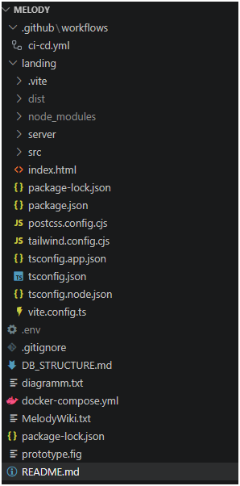

# Melody
Проект представляет собой мобильно-ориентированный лендинг в сфере digital entertaiment
# Melody - Музыкальный веб-сервис

# Платформа для прослушивания музыки, управления плейлистами и персонализации контента.


## Оглавление
- [О проекте](#-o-проекте)
- [Технологии](#-технологии)
- [Структура проекта](#-структура-проекта)
- [Быстрый старт](#-быстрый-старт)
- [Переменные окружения](#-структура-веток)
- [API Документация](#-api-документация)
- [Тестирование](#-тестирование)
- [Вкладка в проект](#-вклад-в-проект)

---

## О проекте

**Melody** - это веб-приложение для:
- Поиск и прослушивания музыкальных треков
- Создания и управления плейлистами
- Персонализация профиля пользователя
- Безопасной авторизации и управления доступом

### Основные функции
| Функция | Описание | Статус |
|---------|----------|--------|
| Регистрация/Вход | JWT-аутенфикация с refresh-токенами | ✅ |
| Профиль пользователи | Аватар, настройки, история | ✅ |
| Музыкальная библиотека | Загрузка, каталогизация, поиск | ✅ |
| Плейлисты | Создание, редактирование, шаринг | ✅ |
| Плеер | Воспроизведение, очередь, рекомендации | ✅ |

---

## ⚙️ Технологии

### Backend
- **Node.js** + **Express** - серверная платформа
- **PostgreSQL** - реляционная база данных
- **Sequalize/Knex** - ORM/Query builder
- **bcrypt** - хэширование паролей
- **jsonwebtoken** - JWT-аутенфикация

### Frontend
- **HTML5/CSS3/JavaScript** - базовая вёрстка
- **Fetch API** - взаимодействие с бэкендом

### Инструменты
- **Git/GitHub** - контроль версий
- **npm** - управление зависимостями
- **dotenv** - управление конфигацией
- **winston/pino** - логирование

---

## 🗂️ Структура проекта



## 🚀 Быстрый старт

### Требования
- Node.js >= 18.x
- PostgreSQL >= 14.x
- npm >= 9.x

### Установка 

# 1. Клонируйте репозиторий
```bash
git clone https://github.com/tehnolize/Melody.git
cd Melody
```

# 2. Установите зависимости
```bash
npm install
```

# 3. Настройте окружение 
```bash
cp .env.example .env
```


# Отредактируйте .env (см. раздел ниже)

# 4. Инициализируйте базу данных
```bash
npm run migrate
```

**Ожидаемый вывод:**

```text
# Задание 6 — Backend, PostgreSQL, аутентификация, загрузка mp3

## Ветка: `feature/PROJ-006-backend-postgresql-auth`

## Описание 
Векта реализует систему безопасности: регистрация, вход, JWT-токены, восстановление пароля и защита маршрутов.


## Что сделано в этой ветке


- Создано схема базы данных
- Добавлены модели пользователей
- Настроены миграции

Спроектирована и создана структура базы данных PostgreSQL для проекта Melody.

## Как запустить:
1. Установите зависимости: `npm install`
2. Настройте .env файл
3. Запустите миграции: `npm run migrate`

## Переменные окружения:
- DB_HOST=localhost
- DB_PORT=5434
- DB_NAME=melody


## Созданные файлы


landing/server/db/
├── schema.sql   — SQL-схема всех таблиц, индексов и ограничений
├── pool.js      — создание пула соединений PostgreSQL
└── init.js      — инициализация БД при запуске сервера
DB_STRUCTURE.md  — документация структуры БД
```
Настроено подключение к PostgreSQL, реализована аутентификация через JWT + cookie, настроена загрузка mp3-файлов через multer.

# 5. Запустите сервер в режиме разработки
```bash
npm run dev
```

# 6. Для продакшена:
```bash
npm start
```

Доступные скрипты (package.json)

| Команды              | Описание                      |
|----------------------|-------------------------------|
|npm run dev           | Запуск с nodemon (hot-reload) |
|npm start             | Запуск в продакшен-режиме     |
|npm run migrate       | Применение миграций БД        |
|npm run migrate:undo  | Откат последней миграции      |
|npm test              | Запуск тестов                 |
|npm run test:coverage | Тесты с покрытием             |
|npm run lint          | Проверка стиля кода (ESLint)  |